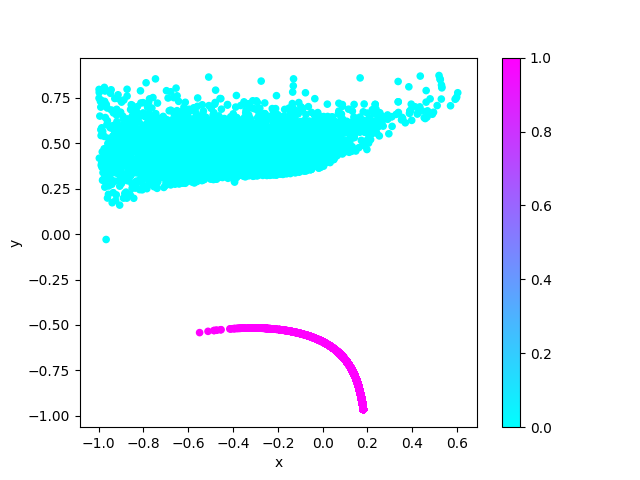

# amznlog-cluster-sample

RNNによるログデータ（時系列データ）の分散表現作成サンプル
動作環境：

* Python3
* Chainer3

詳しい解説

## 使用データ

[Amazon Access Samples Data Set][1]

## License

[Gnu AGPL 3.0](LICENSE)

[1]: https://archive.ics.uci.edu/ml/datasets/Amazon+Access+Samples
